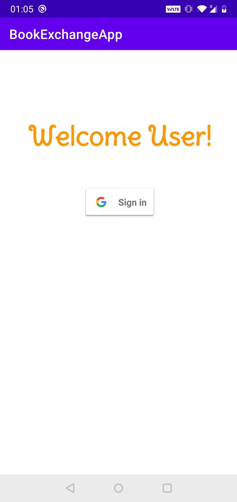
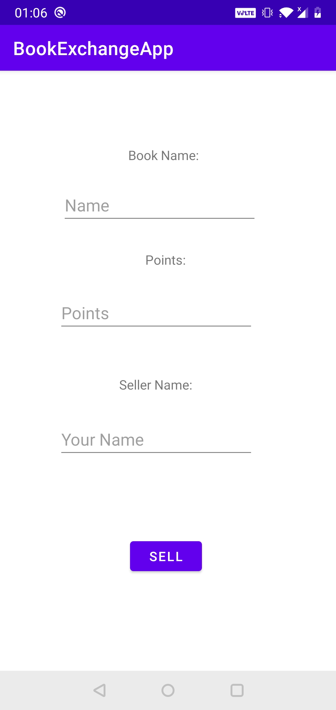
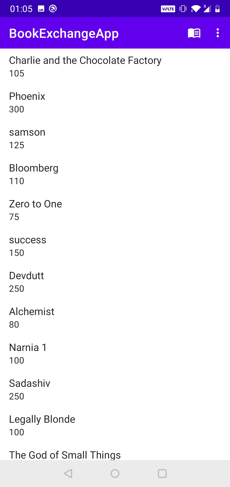
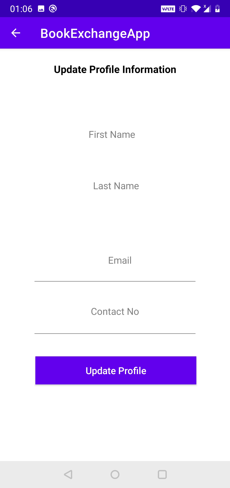
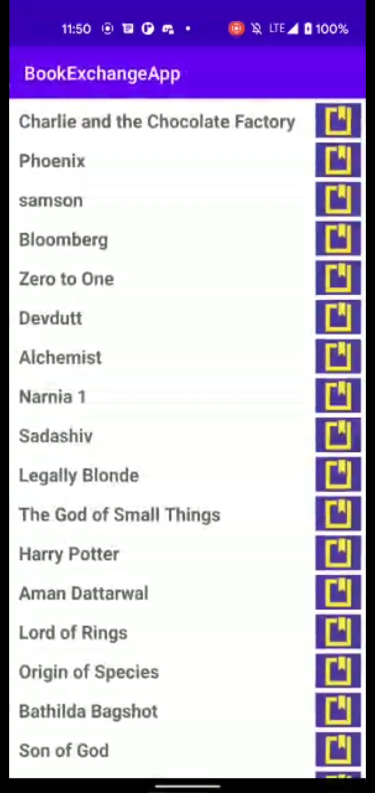
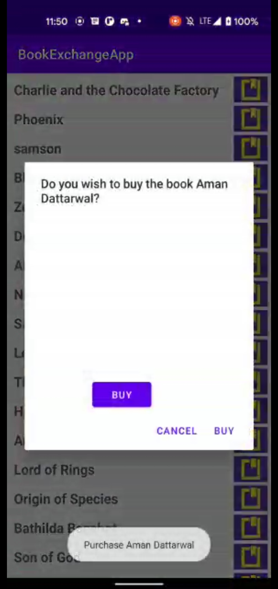

This is a simple Book Exchange app designed for exchanging books among people and also as a project for the hackathon held by DEVSOC BITS GOA. This project was made by Rohan Sahay, Vinay Kumar and Anubhav Kashyap using only Kotlin and Firebase. The user must login through their gmail in order to access the app. Users can share any number of books without any constraints.

UNFORTUNATELY THE APP WAS NOT COMPLETELY DONE DUE TO TIME CONSTRAINTS, THIS DELAY IS DEEPLY REGRETTED.

                   

                        

